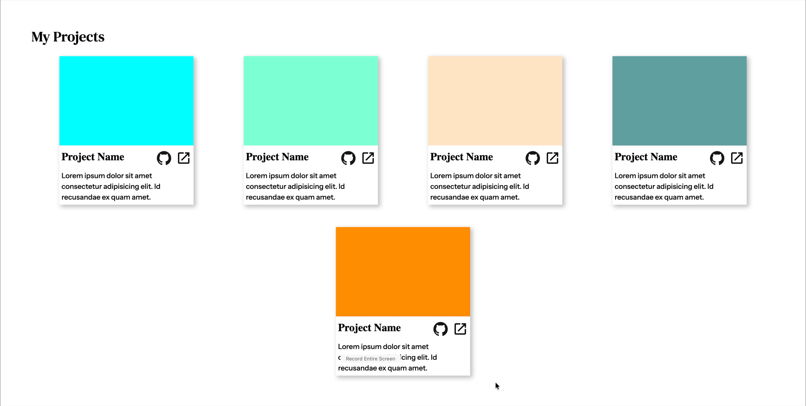

# homepage

This was a project in The Odin Project online cource to learn full stack development. The task was to replicate a template using CSS and HTML. This project uses placeholder assets.

## Page Content

